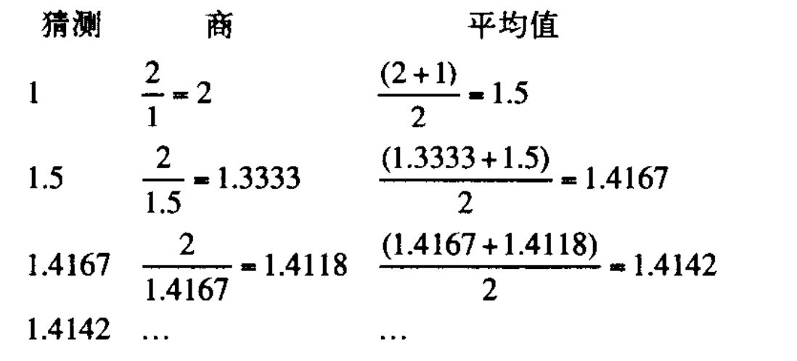

## SICP

**scheme 语法：**

scheme 都是前缀运算，例如 `(+ 2 3)`，我们平常用的一般是中缀调用 `2 + 3`。前缀调用的好处是，可以实现不定参数调用，如
`(+ 2 3 4)`，平常三个数的加法需要 `2 + 3 + 4`。

scheme 中小括号很常见，上述前缀调用中，如果不使用小括号，调用多个参数时，表达式的界限就很难确定。

scheme 中使用 define 来定义变量，`(define size 2)` 这样 size 就和 2 关联上了，就可以把 size 当做 2 来使用，也可以定义一
个函数 `(define (square x) (* x x )`。

scheme 也有分支控制语句，`cond`，例如下述是一个求绝对值的方法

```lisp
(define (abs x)
  (cond ((> x 0) x)
        ((= x 0) 0)
        ((< x 0) (- x))))
```

上述写法类似于 JS 中的 switch 语句。日常编码中，if 这样两个分支的控制语句会更常见一点，scheme 中也有对应的实现方式，一种
是使用 cond 加 else（else 类似 JS 中的 default，前面所有的条件都不匹配就会执行 else ），另一种就是 if ：

```lisp
(define (abs x)
  (cond ((< x 0) (-x))
        (else x)))

(define (abs x)
  (if (< x 0)
      (- x)
      x))
```

逻辑运算，and，or，和 not 也是存在的。

- (and <e1> ... <en>) 使用 and 对 e1 到 en 的表达式依次求值，存在一个为假，就不再继续（短路运算），如果前面全部为真，and
  的结果和 en 表达式结果相同。
- (or <e1> ... <en>) 和 and 运算类似，or 也会从左到右依次求值，存在一个为真 or 的结果就是这个表达式的结果，全部为假，or
  的结果就是假。
- (not <e>) not 表达式的值，是对 e 取反的结果

终端命令：

```
(load "sample.scm") -- 加载本地文件，这样就可以运行文件中编写的代码了
(exit) -- 退出 scheme
```

### 第一章

#### 应用序求值和正则序求值：

所谓应用序求值，即先求值，再将所得值带入表达式。

正则序，也即不先求值，而是把值展开为所代表的表达式，将表达式完全展开后再求值。

例如：

```js
let b = a + 1
c = b * b

// 应用序求解模拟 ： a==1 ==> b = 2 ==> c = 2 * 2 = 4
// 正则序求解模拟 ： a==1 ==> b = a + 1 ==> c = (a + 1) * (a + 1) = 2 * 2 = 4
```

可以看到，正则序的求值过程中，存在大量基础表达式计算的重复，上述例子中 `(a + 1)` 就会被重复计算。

习题中的 1.4 更清楚的描述了正则序和应用序的另一个区别：

```lisp
(define (p) (p))
(define (test x y)
  (if (= x 0)
      0
      y))

(test 0 (p))
```

上述代码在正则序中，由于不会立即求值，会先运行 test 方法，发现满足第一个条件，返回结果 0。在应用序中，程序会卡死，因为
`(p)` 会一直重复调用自身，这样程序就一直没有办法走下去。

Lisp 中也存在**高阶函数**：

```lisp
(define (a-plus-abs-b a b)
  (if (> b 0) + -) a b)
```

乍一看，上述代码有一点不明白什么意思，当你了解了 Lisp 也可以使用高阶函数，就会豁然开朗。if 语句会根据 b 是否大于零来返回
不同的操作符，在对后面的 a b 进行相应运算。

#### 块结构

下面是牛顿法求 2 的平方根的过程，首先从 1 开始猜测，1 肯定不满足条件，接着优化这猜测，取 2 和 1 的平均值，重复这个过程直
到结果足够好。更通用的描述，x 是我们需要求解的值，首先对 x 的平方根选择一个猜测值 y（1），如果猜测不符合预期，下一步更新
猜测值为 `y = (y + x / y)/2`



使用代码可以抽象为下面几个过程

```lisp
(define (average x y)  ; 定义一个求平均值的过程
  (/ (+ x y) 2))

(define (improve guess x) ; 更新猜测值
  (average guess (/ x guess))

(define (good-enough? guess x) ; 判断是否符合要求
  (< (abs (- (square guess) x)) 0.001))

(define (sqrt-iter guess x) ; 主体函数，guess 是我们猜测的平方根，x 是需要求解平方根的值
  (if (good-enough? guess x) ; 判断是否符合我们给定的平方根条件
      guess
      (sqrt-iter (improve guess x) ; 不符合就递归调用
                 x)))
(define (sqrt x) ; 从 1 开始猜
  (sqrt-iter 1.0 x))

```

上述代码，拆分了几个基础过程，并将其组合起来形成了一个完整功能。这种代码模式很有函数式编程的风格，很好理解。所有方法全部
定义在全局，在代码量增加后可能会出现一些问题。比如说 improve 这个方法，很难保证在别的功能中，不会有一个类似的更新值功能
，自然我们更想也使用 improve 名字（经常想名字很烦的）。定义在全局的方法，重名就会导致编译时不知道需要用哪个函数。所以这
些服务于一个功能的方法，我们希望能局部化。

```lisp
(define (sqrt x)
  (define (good-enough? guess x)
     (< (abs (- (square guess) x)) 0.001))
  (define (improve guess x)
    (average guess (/ x guess)))
  (define (sqrt-iter guess x)
    (if (good-enough? guess x)
        guess
        (sqrt-iter (improve guess x)
                   x)))
  (sqrt-iter 1.0 x))
```

这样 `good-enough?` 这些方法就被约束在 `sqrt`，同时可以发现，这些方法中使用的 x 都是同一个 x，这样我们也可以省略内部方法
的 x 参数，直接让它们使用 `sqrt` 接收的 x 就行了，这就是常说的`词法作用域`。通过词法作用域，我们就可以将功能拆分成一个个
`块结构`，这种思想来自于 Algol 60。

#### 1.2 线性的递归和迭代

如果需要实现一个阶乘的方法，数学上的定义很简单。

> n! = n _ (n -1) _ (n - 2) ... \* 1
>
> ​ = n _ ( (n -1) _ (n - 2) ... \* 1 )
>
> ​ = n \* (n - 1)!

这样可以简单写出一个方法

```lisp
(define (factorial n)
  (if (= n 1)
      1
      (* n (factorial (- n 1)))))
```

考察这样一个过程，如果我们计算 (factorial 4)，就会有一下过程

```lisp
(factorial 4)
(* 4 (factorial 3))
(* 4 (* 3 (factorial 2)))
(* 4 (* 3 (* 2 (factorial 1))))
(* 4 (* 3 (* 2 1)))
```

直观感受上就能看出一定要展开到随后一级，才能收缩计算，也就是这个方法需要保存一个延迟执行的计算链条。这样的一
个`递归计算过程`可能需要消耗很多空间，当没有达到边界条件时，展开的计算结果没有返回，所以需要一直保持函数的空间。

还有一种思考方式，我们定义阶乘过程是，先使用 1 乘上 2，再将得到的结果乘上 3，以此类推，知道乘到 n。

考察整个过程，可以叫过程分为两部分，一部分是乘法操作，记做 product，一部分是循环控制，记做 counter。整个变化过程规律如下
：

> product <- product \* counter
>
> counter <- counter + 1

这样就可以写出一下方法：

```lisp
(define (factorial n)
  (fact-iter 1 1 n))

(define (fact-iter product counter max-count)
  (if (> counter max-count)
      product
      (fact-iter (* product counter)
                 (+ counter 1)
                 max-count)))
```

在 `fact-iter` 中，每次运算我们都会更新参数对应的值。这样当参数传入下一次调用的方法中，外层函数中的值，就已经和下一轮函
数的值联系断开了。这样也没有必要保存上一次调用的 context，空间上每次只需要保留一个函数的空间。例如：

```lisp
(factorial 6)
(fact-iter 1 1 6)
(fact-iter 1 2 6)
(fact-iter 2 3 6)
...
(fact-iter 720 7 6)
720
```

如果仔细思考，无论那个时刻，fact-iter 调用过程中，都包含了每个状态的完整描述。从计算的角度看，这是一个迭代的计算过程。也
就是这个版本的 factorial，在递归过程中封装了一个迭代计算。对于这种迭代计算过程，完全可以用常数空间去描述，也就是常说的
`尾递归优化`。

##### 1.2.2 树形递归

对于斐波那契数列的计算，从定义看是一个常见的树形递归。

```lisp
(define (fib n)
  (cond ((= n 0) 0)
    		((= n 1) 1)
    		(else (+ (fib (- n 1))
                 (fib (- n 2))))))
```

可以看到描述很简单，定义两个边界条件 `n = 0` 和 `n = 1`，其他情况通过 `f(n) = f(n-1) + f(n-2)` 来递归计算。也就是每次计
算会展开两个分支，f(n -1) 和 f(n - 2)，知道最终展开到叶节点 f(0) 和 f(1) 的情况。

看起来描述很简单，但是计算起来非常糟糕，全是冗余计算。比如，f(n -1) 的计算过程中，本身就包含 f(n)，更不用说最后的展开结
果，全是 f(0) 和 f(1)，这些计算都会被重复计算。

对于这种情况，我们当然也会想到迭代计算：

```lisp
(define (fib n)
  (fib-iter 0 1 n))

(define (fib-iter a b max-count)
  (if (= max-count 0)
      a
      ;更新 n-1(b) 变成 n-2，然后计算 n-1 = a + b
      (fib-iter b (+ a b) (- max-count 1)))
```

### 第二章

#### 什么是数据

例如我们需要计算有理数，首先需要在数据层面定义什么是有理数。我想每个人对于数的认识，都是一步一步来的。首先是正整数，然后
加上一个零，或许还有分数，随后是分数。那具体要怎么表示有理数，统一的方式就是使用分数的方式。

所以这里我们假设，已经有了通过分子，和分母来构造出一个有理数的方法，同时我们假设，还有两个方法可以分别去取得有理数的分子
和分母。例：

```lisp
(make-rat <n> <d>) 返回一个有理数，分子是整数 n，分母是整数 d
(numer <x>) 返回有理数 x 的分子
(denom <x>) 返回有理数 x 的分母
```

接着我们需要对我们的假设进行约束，如果满足约束，那这个实现就是可行的。


代码描述如下：

```lisp
(define (add-rat x y)
  (make-rat (+
             (* (numer x) (denom y))
             (* (denom y) (numer x))) ; 构造新的分子
            (* (denom x) (denom y)))) ; 构造新的分母

(define (sub-rat x y)
  (make-rat (-
             (* (numer x) (denom y))
             (* (denom y) (numer x))) ; 构造新的分子
            (* (denom x) (denom y)))) ; 构造新的分母
(define (mul-rat x y)
  (make-rat (* (numer x) (numer y))
            (* (denom x) (denom y))))

(define (div-rat x y)
  (make-rat (* (numer x) (denom y))
            (* (denom x) (numer y))))

(define (equal-rat x y)  ; 也既十字交叉相乘
  (= (* (numer x) (denom y))
     (* (numer y) (denom x))))
```

**序对**

为了构造有理数上面的三个基础方法，引入序对的概念，类似一个长度为 2 的元组。通过 cons 方法构造一个序对，方法接受两个参数
，

通过 car 和 cdr 可以分别取出 cons 中保存的两个参数，类似于 head 和 tail 方法。

```lisp
(define x cons(1 2))
(car x) ----> 1
(cdr x) ----> 2
```

这样我们就可以实现那三个有理数相关的基础方法了

```lisp
(define (make-rat n d) (cons n d))
(define (numer x) (car x))
(define (denom x) (cdr x))
```

对照我们的约束条件，可以满足。虽然这样表示还是有问题，比如说是否需要约分，是计算时候约分还是取值时候约分，但是功能是没有
问题的。

可能这种表现形式，和我们熟悉的方式有点不一样，通过一个复合数据类型表示一个数。也正是这种情况，促使我们思考数据的本质。实
际上表现形式并不重要，无论你如果表示，只要最终能实现我们需要的结果就是可行的。

我为什么喜欢 JS 也是因为这个原因（我讨厌强类型约束），实际上我们可以不把数据看成一个数，它可以是任何东西。make-rat 中可
以传入任何数据类型，car 和 cdr 都可以得到我们想要的结果。在这个过程中，数据本身并不重要。只要仔细考察过，过程是可靠的，
我们甚至可以直接使用过程作为参数或者变量，进行运算化简。

假设有这样一个函数，调用就返回一个固定值，可不可以将这个函数看作一个常量？又有另一个函数，接收一个值，返回值有一个 map
方法可以修改这个值，还有一个 get 方法每一次调用，就将内部存储的值返回出去，这个函数可不可以看作一个变量？用 JS 描述，这
样两种行为唯一的区别就在于，变量使用时直接只用变量名 variable，函数需要调用 variable()，除开形式上的差异，并不能从表现上
区分这两种情况。函数式编程最终是将过程（函数）组合起来，这样也可以在最后一步需要时才执行，也就可以做到惰性运算。

习惯了命令式编程，可能会觉得接下来的讨论毫无意义。我们习惯了变量的概念，会难以理解 Haskell 中的 id 函数（接受一个值，返
回这个值），为什么要做这种冗余的事情：

```haskell
id :: a -> a
id x = x
```

每个函数（或者说态射）返回一个新值，将所有过程在最后组合起来就能得到一个结果。

这里忽略了变量，将着眼点放在函数上，其实也就是常说的 PointFree。我也不知道这种思考对于编程到底有什么好处，它只是一点思考
形式上的区别。非 PointFree 的模式下，思考的中心在变量身上，对变量进行一步步的变形。PointFree 的着眼点，更多在于过程和类
型。就像物理推导中，只要量纲等效，过程可靠，并不需要关心使用的具体使用的是什么单位。

这些逻辑上的抽象，并不是在告诉你，孰优孰劣。我个人觉得编程上，没有优劣，只有适合与不适合。在实际的工作中，我也会懒得进行
细致的拆分，写一个很长很长的函数，某些情况下，这反而是一种高效的手段。拆分代码片段，最主要的作用，是减轻阅读的心智负担，
当然习惯了代码块，会觉得这种处理方式效率更高。

对于新手（不管是编程，还是其他方面），如何对一个过程进行层次化分解与重新复合，是一项让人着迷，同时又深感似是而非的工作。
例如，高中解立体几何，做合适的辅助线，将问题拆解成我们熟悉范式，是一种高效的手段。难点在于，如何做辅助线。良师的循循善诱
，也就是在合适的角度，去引导拆分每一步，进而让整个解题思路豁然开朗。对比到编程上，拆分代码块，也需要做到每一步目的清晰，
并且能引导阅读的人，立马明白下一步的思路。如果不做拆分，可能需要读完整体代码才能理解。如果粒度太细，又会让阅读的人过多的
思考，这一步有没有什么别的意义，在阅读下一步代码时候还需要记住之前的工作，其实也不是太好，需要在合适的时候，进行组合。对
细粒度的代码，进行组合，使之形成一个新的代码块，是一个很考究的过程。代码块的实现过程结束，就可以变成黑箱，不必关心它的实
现细节，只关心它与其他代码块的相互影响。
