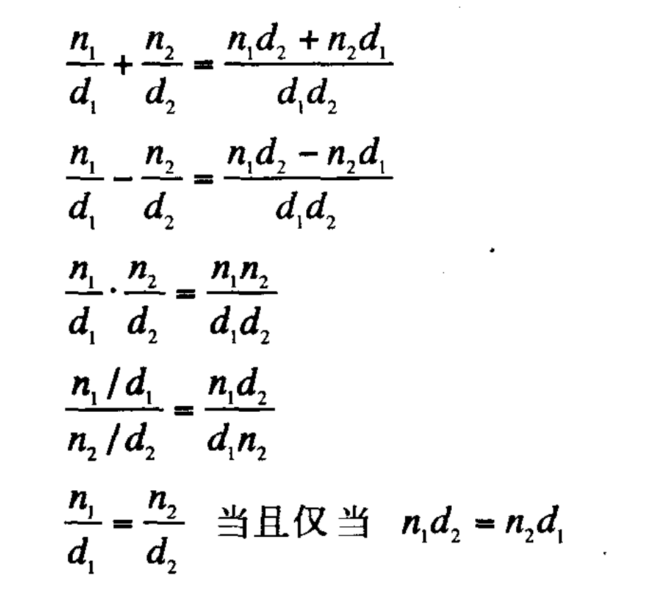

### 第一章

#### 基础概念

**应用序求值和正则序求值：**

所谓应用序求值，即先求值，再将所得值带入表达式。

正则序，也即不先求值，而是把值展开为所代表的表达式，将表达式完全展开后再求值。

例如：

```js
let b = a + 1
c = b * b

// 应用序求解模拟  a==1 ==> b = 2 ==> c = 2 * 2 = 4
// 正则序求解模拟  a==1 ==> b = a + 1 ==> c = (a + 1) * (a + 1) = 2 * 2 = 4
```

Inc(它将参数增加 1)， dec(它将参数减少 1)

```scheme
(define (+ a b)
  (if (= a 0)
      b
      (inc (+ (dec a) b)))
```

(+ 4 5)

​ -> 4 !== 0

​ -> Inc ( + (4-1) 5)

​ -> inc( 3 + 5)

​ -> inc(8)

-> 9

递归：

```scheme
(define (cc amount kinds-of-coins)
  (cond ((= amount 0) 1)
        ((or (< amount 0) (= kinds-of-coins 0)) 0)
        (else (+ (cc amount
                     (- kinds-of-coins 1))
                 (cc (- amount
                        (first-denomination kinds-of-coins))
                     kinds-of-coins)))))

(define (first-denomination kinds-of-coins)
  (cond ((= kinds-of-coins 1) 1)
        ((= kinds-of-coins 2) 5)
        ((= kinds-of-coins 3) 10)
        ((= kinds-of-coins 4) 25)
        ((= kinds-of-coins 5) 50)))
```

解释，cc 代表查找一定数目的美元可以有多少种兑换方式实现方法，可供选择的币值有，半美元，四分之一美元，10 美分，5 美分，1
美分。 参数：amount 代表需要计算的金额， kinds-of-coins 代表提供多少种币值组合。

first-denomination 方法代表，参数 kinds-of-coins 代表提供多少种币值组合，返回结果为第一个币值是多少，单位是美分（更直观
的解释是，以美分为单位，上述币值组成一个数组，[ 50, 25, 10, 5, 1]，不同的币值组合，从右向左切片，也即 1 -> [ 1 ]， 2 ->
[ 5, 1] ...，返回第一个币值）。

逻辑如下：

首先约定边界条件： 当金额是 0 的时候，我们认为这也是一种组合，结果是 1。

​ 当金额小于 0，或者提供的币种组合为 0，我们认为这种情况不成立，所以组合是 0。

递归过程，分两种情况递归：

首先是针对组合情况的递归，例如，提供 2 个币值组合，结果就等于使用 2 种币值的组合，加上只使用 （2-1 = 1）种币值的组合，也
就是 else 上面的那种情况。

接下来是金额的递归，比如 1 美元的组合，相当于完整的 1 美元使用 5 币值的组合，加上 1 美元减少 50 美分剩下的金额使用 5 币
值的组合。这种递归，会将当前币值组合所有的组合方式计算出来。

高阶函数抽象：

求给定范围内的整数立方和：

```scheme
(define (sum-cube a b)
  (if (> a b)
      0
      (+ (cube a) (sum-cube (+ a 1) b)))
```

其中 cube 是求立方的方法，如果 a > b，即达到边界条件，结束，否则进行递归。

以下是 sum 的抽象，针对给定范围内数，对数据做一定变换求和的方式。

sum 也即最后抽象的函数，term 是数据的变换方式，如求平方和，term 也就是(\* x x)，next 是控制变量的变化方式，如自增。

```scheme
(define (sum term a next b)
  (if (> a b)
      0
      (+ (term a)
         (sum term (next a) next b)))
```

这种方式看上去会非常别扭，因为即使 next 是非常简单的自增，也需要显示定义一个函数，

如果可以简单将函数定义写入就会舒服很多，所以有了 lambda 表达式。

局部变量 let

针对这样一个函数。 f(x,y) = x(1 + xy)^2 + y(1 - y) + (1 + xy)(1 - y)

我们希望构建两个中间变量 a = (1 + xy)，b= (1 -y)，这样表达式可以简单表示为 f(x,y) = xa^2 + by + ab

使用代码表示：

```scheme
(define (fn x y)
  (define (fn-helper a b)
    (+ (* x (squart a))
       (* y b)
       (* a b)))
  ((fn-helper (+ 1 (* x y))
              (- 1 y))))
```

也就是首先构造一个函数，将我们希望变现的形式 xa^2 + by + ab 描述出来，随后再将 a，b 使用 x，y 描述出来传入。

上述方法，利用 let 构造局部变量，可以表述为一下方式

```scheme
(define (f x y)
  (let (( a (+ 1 (* x y)))
        (b (- 1 y)))
    (+ (* x (squart a))
       (* y b)
       (* a b))))
```

### 第二章

#### 什么是数据

例如我们需要计算有理数，首先需要在数据层面定义什么是有理数。我想每个人对于数的认识，都是一步一步来的。首先是正整数，然后
加上一个零，或许还有分数，随后是分数。那具体要怎么表示有理数，统一的方式就是使用分数的方式。

所以这里我们假设，已经有了通过分子，和分母来构造出一个有理数的方法，同时我们假设，还有两个方法可以分别去取得有理数的分子
和分母。例：

```lisp
(make-rat <n> <d>) 返回一个有理数，分子是整数 n，分母是整数 d
(numer <x>) 返回有理数 x 的分子
(denom <x>) 返回有理数 x 的分母
```

接着我们需要对我们的假设进行约束，如果满足约束，那这个实现就是可行的。



代码描述如下：

```lisp
(define (add-rat x y)
  (make-rat (+
             (* (numer x) (denom y))
             (* (denom y) (numer x))) // 构造新的分子
            (* (denom x) (denom y)))) // 构造新的分母

(define (sub-rat x y)
  (make-rat (-
             (* (numer x) (denom y))
             (* (denom y) (numer x))) // 构造新的分子
            (* (denom x) (denom y)))) // 构造新的分母
(define (mul-rat x y)
  (make-rat (* (numer x) (numer y))
            (* (denom x) (denom y))))

(define (div-rat x y)
  (make-rat (* (numer x) (denom y))
            (* (denom x) (numer y))))

(define (equal-rat x y)   // 也既十字交叉相乘
  (= (* (numer x) (denom y))
     (* (numer y) (denom x))))
```

**序对**

为了构造有理数上面的三个基础方法，引入序对的概念，类似一个长度为 2 的元组。通过 cons 方法构造一个序对，方法接受两个参数
，

通过 car 和 cdr 可以分别取出 cons 中保存的两个参数，类似于 head he tail 方法。

```lisp
(define x cons(1 2))
(car x) ----> 1
(cdr x) ----> 2
```

这样我们就可以实现那三个有理数相关的基础方法了

```lisp
(define (make-rat n d) (cons n d))
(define (numer x) (car x))
(define (denom x) (cdr x))
```

对照我们的约束条件，可以满足。虽然这样表示还是有问题，比如说是否需要约分，是计算时候约分还是取值时候约分，但是功能是没有
问题的。

可能这种表现形式，和我们熟悉的方式有点不一样，通过一个复合数据类型表示一个数。也正是这种情况，促使我们思考数据的本质。实
际上表现形式并不重要，无论你如果表示，只要最终能实现我们需要的结果就是可行的。

我为什么喜欢 JS 也是因为这个原因（我讨厌强类型约束），实际上我们可以不把数据看成一个数，它可以是任何东西。make-rat 中可
以传入任何数据类型，car 和 cdr 都可以得到我们想要的结果。在这个过程中，数据本身并不重要。只要仔细考察过，过程是可靠的，
我们甚至可以直接使用过程作为参数或者变量，进行运算化简。

从这个角度考察函数是一等公民，就会更加清晰。Haskell 中并没有变量，全是函数（我们也只需要函数）。每个函数返回一个新值（或
者说一个过程），将所有过程在最后组合起来就能得到一个结果。有些人可能不适应这种没有变量的描述，如果我们假设有这样一个函数
，调用就返回一个固定值，可不可以将这个函数看作一个常量？又有另一个函数，接收一个值，返回值有一个 map 方法可以修改这个值
，还有一个 get 方法每一次调用，就将内部存储的值返回出去，这个函数可不可以看作一个变量？用 JS 描述，这样两种行为唯一的区
别就在于，变量使用时直接只用变量名 variable，函数需要调用 variable()，除开形式上的差异，并不能从表现上区分这两种情况。同
时由于函数式编程最终是将过程（函数）组合起来，这样也可以在最后一步需要时才执行，也就可以做到惰性运算。
